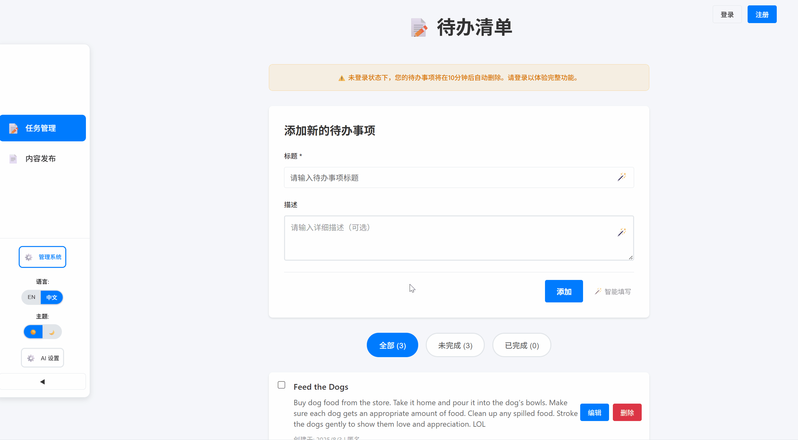

# 🤖 AI Super Task Assistant - TodoMaster

[English README](README.en.md) 

[中文文档](README.md)

**Next-generation AI-native todo management system**, a modern full-stack Todo application that integrates artificial intelligence technology. More than just simple task management - it's your intelligent productivity assistant!

## 🎬 Feature Demonstrations

🔐 **Complete User System** - Registration, login, and user management all in one

⚡ **Django + React Full-Stack Architecture** - Modern tech stack with high-performance experience

🛡️ **Frontend Management System** - Modern management interface built with React

🌍 **Multi-language Support** - Seamless switching between Chinese and English

🌙 **Dark Mode** - Eye-friendly dark theme

📱 **Responsive Design** - PC-optimized experience

### 📋 Main Application Interface

*Intelligent todo management interface with quick add, edit, and status toggle*

### 🤖 AI Smart Form Filling

*Revolutionary AI-powered smart filling feature makes creating todos unprecedentedly simple*

### 🔧 Management System

*Modern frontend management interface for easy user and data management through REST API*

## 🚀 Powerful Features

### 💡 AI-Powered Features
- 🤖 **AI Smart Form Filling** - AI-based intelligent content generation
- 🎯 **Smart Task Recommendations** - Task recommendations based on user habits
- 📊 **Intelligent Data Analysis** - Smart statistics for task completion

### 👤 User Management System
- 🔐 **Secure Registration & Login** - JWT authentication, secure and reliable
- 👥 **Role-based Permission Control** - Multi-level permission system with superuser, admin, and regular user roles
- 🎛️ **Smart Menu Routing** - Dynamic menu and route permissions based on user roles
- 📝 **Personal Profile Management** - Comprehensive user information management
- 🛡️ **Frontend Management Interface** - Modern management system built with React

### 📋 Todo Management
- ✅ Create, edit, and delete todo items
- 🎯 Mark task priority and status
- 🔍 Smart filtering and search functionality
- 📅 Task deadline management
- 📊 Task completion statistics and analysis

### 🎨 User Experience
- 🌍 **Internationalization Support** - Chinese/English multi-language
- 🌙 **Theme Switching** - Light/Dark mode
- ⚡ **Real-time Sync** - Real-time data updates
- 📱 **Modern UI** - Clean and beautiful interface design

### 🎭 User Roles
- **Superuser** - Highest system privileges, can manage all users and data
- **Admin** - Can manage regular users and todos, cannot manage other admins
- **Regular User** - Can only manage their own todos

### 🎛️ Permission Control Features
- **Dynamic Menu Routing** - Automatically show/hide menu items based on user role
- **API Permission Verification** - Backend interface-level permission validation
- **Frontend Route Guards** - Prevent unauthorized users from accessing restricted pages
- **Operation Permission Control** - Fine-grained CRUD operation permission management

## 🌐 Quick Access

🌐 **Backend API**: `http://localhost:8000`  
🎨 **Frontend App**: `http://localhost:5173`

**Note:** The management system is fully integrated into the frontend React application and communicates with the backend through REST API, eliminating the need for additional Django Admin backend.

## 🛠️ Tech Stack

### 🐍 Backend Technologies
- **Python 3.13+** - Latest stable Python version
- **Django 5.2+** - Powerful web framework
- **Django REST Framework 3.16+** - API development tool
- **SQLite** - Lightweight database
- **JWT Authentication** - Secure user authentication
- **CORS Support** - Cross-Origin Resource Sharing

### ⚛️ Frontend Technologies
- **React 19+** - Latest React version
- **TypeScript 5.8+** - Type-safe JavaScript
- **Vite 7+** - Lightning-fast build tool
- **Sass** - Powerful CSS preprocessor
- **Axios** - HTTP client
- **React-i18next** - Internationalization solution

### 🔧 Development Tools
- **pnpm** - Efficient package manager
- **ESLint** - Code quality checker
- **Prettier** - Code formatter
- **Git** - Version control

## Quick Start

### Requirements
- Python 3.13+
- Node.js 18+
- pnpm
- Git

### 🔧 One-Click Launch

1. **Clone the Project**
```bash
git clone https://github.com/1nFrastr/kai-todo-app.git
cd kai-todo-app
```

2. **Backend Setup**
```bash
# Navigate to backend directory
cd backend

# Create and activate virtual environment
python -m venv venv
source venv/Scripts/activate  # Windows Git Bash
# or source venv/bin/activate  # macOS/Linux

# Install dependencies
pip install -r requirements.txt

# Database migration
python manage.py makemigrations
python manage.py migrate

# Create superuser (optional)
python manage.py createsuperuser

# Start backend service
python manage.py runserver
```
🌐 Backend Service: `http://localhost:8000`

3. **Frontend Setup**
```bash
# Navigate to frontend directory
cd frontend

# Install dependencies
pnpm install

# Start frontend service
pnpm run dev
```
🎨 Frontend App: `http://localhost:5173`

4. **Access Management System (Optional)**
   
   The management system is integrated into the frontend application. Access management features after logging in with an admin account.

🌐 Backend API: `http://localhost:8000`
🎨 Frontend App: `http://localhost:5173`
🌐 Management System: `http://localhost:5173/admin`

## User Guide

### 🎯 Basic Operations
1. **Register/Login** - Create your exclusive account
2. **Role Permissions** - Enjoy different levels of functionality based on assigned roles
3. **Add Tasks** - Use AI smart filling or manual input
4. **Manage Tasks** - Edit, delete, mark completion status
5. **Smart Filtering** - Quick filtering by status and priority
6. **Management Features** - Admins can access user management and other advanced features
7. **Theme Switching** - Switch between light/dark modes at will
8. **Language Switching** - Seamless Chinese/English switching

### 🤖 AI Feature Usage
- When adding tasks, click the "AI Smart Fill" button
- Enter a simple description, and AI will automatically generate detailed task content
- Support for intelligent recommendations for task priority and categorization

## 🤝 Contributing

We welcome all forms of contributions! Please check `.github/copilot-instructions.md` for detailed development guidelines.

### 🔧 Development Workflow
1. Fork this project
2. Create a feature branch (`git checkout -b feature/AmazingFeature`)
3. Commit your changes (`git commit -m 'Add some AmazingFeature'`)
4. Push to the branch (`git push origin feature/AmazingFeature`)
5. Create a Pull Request

## 📄 License

This project is licensed under the MIT License - see the [LICENSE](LICENSE) file for details

## 🔗 Related Resources

- [Django Official Documentation](https://docs.djangoproject.com/)
- [Django REST Framework](https://www.django-rest-framework.org/)
- [React Official Documentation](https://react.dev/)
- [Vite Build Tool](https://vitejs.dev/)
- [TypeScript Handbook](https://www.typescriptlang.org/)

---

⭐ If this project helps you, please give us a Star!

🐛 Found a Bug? [Submit an Issue](https://github.com/1nFrastr/kai-todo-app/issues)

💡 Have a feature suggestion? [Create a Discussion](https://github.com/1nFrastr/kai-todo-app/discussions)
