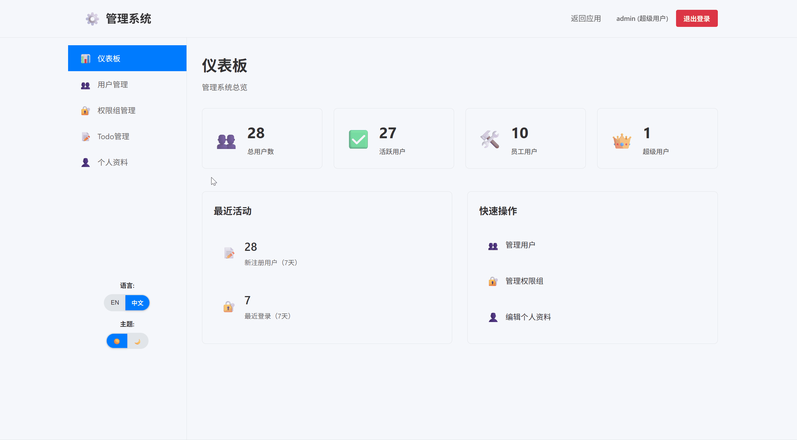

# 🤖 AI超级任务助手 - TodoMaster

[English README](README.en.md) 

[中文文档](README.md)

**下一代AI原生的待办事项管理系统**，融合人工智能技术的现代化全栈Todo应用。不仅是简单的任务管理，更是您的智能生产力助手！

## 🎬 功能演示

🔐 **完善的用户系统** - 注册、登录、用户管理一应俱全  

⚡ **Django + React 全栈架构** - 现代化技术栈，高性能体验

🛡️ **前端管理系统** - 基于React的现代化管理界面

🌍 **多语言支持** - 中英文无缝切换

🌙 **暗黑模式** - 护眼暗色主题

📱 **响应式设计** - PC端优化体验


### 📋 主应用界面

*智能化的待办事项管理界面，支持快速添加、编辑和状态切换*

### 🤖 AI智能表单填写

*革命性的AI智能填写功能，让创建待办事项变得前所未有的简单*

### 🔧 管理系统

*现代化的前端管理界面，通过REST API轻松管理用户和数据*

## 🚀 强大功能

### 💡 智能化功能
- 🤖 **AI智能表单填写** - 基于AI技术的智能内容生成
- 🎯 **智能任务推荐** - 根据用户习惯推荐任务
- 📊 **数据智能分析** - 任务完成情况智能统计

### 👤 用户管理系统
- 🔐 **安全注册登录** - JWT认证，安全可靠
- 👥 **分角色权限控制** - 超级管理员、普通管理员、普通用户多级权限体系
- 🎛️ **智能菜单路由** - 基于用户角色动态显示菜单和路由权限
- 📝 **个人资料管理** - 完善的用户信息管理
- 🛡️ **前端管理界面** - React构建的现代化管理系统

### 📋 待办事项管理
- ✅ 创建、编辑、删除待办事项
- 🎯 标记任务优先级和状态
- 🔍 智能筛选和搜索功能
- 📅 任务截止日期管理
- 📊 任务完成统计分析

### 🎨 用户体验
- 🌍 **国际化支持** - 中文/英文多语言
- 🌙 **主题切换** - 浅色/暗黑模式
- ⚡ **实时同步** - 数据实时更新
- 📱 **现代化UI** - 简洁美观的界面设计

### 🎭 用户角色
- **超级管理员 (Superuser)** - 拥有系统最高权限，可管理所有用户和数据
- **管理员 (Admin)** - 可管理普通用户和待办事项，无法管理其他管理员
- **普通用户 (User)** - 只能管理自己的待办事项

### 🎛️ 权限控制特性
- **动态菜单路由** - 根据用户角色自动显示/隐藏菜单项
- **API权限验证** - 后端接口级别的权限校验
- **前端路由守卫** - 防止未授权用户访问受限页面
- **操作权限控制** - 细粒度的CRUD操作权限管理://localhost:5173`

**注意：** 管理系统已完全集成在前端React应用中，通过REST API与后端通信，无需额外的Django Admin后台。

## 🛠️ 技术栈

### 🐍 后端技术
- **Python 3.13+** - 最新稳定版Python
- **Django 5.2+** - 强大的Web框架
- **Django REST Framework 3.16+** - API开发利器
- **SQLite** - 轻量级数据库
- **JWT认证** - 安全的用户认证
- **CORS支持** - 跨域资源共享

### ⚛️ 前端技术
- **React 19+** - 最新版本React
- **TypeScript 5.8+** - 类型安全的JavaScript
- **Vite 7+** - 极速构建工具
- **Sass** - 强大的CSS预处理器
- **Axios** - HTTP客户端
- **React-i18next** - 国际化解决方案

### 🔧 开发工具
- **pnpm** - 高效的包管理器
- **ESLint** - 代码质量检查
- **Prettier** - 代码格式化
- **Git** - 版本控制

## 快速开始

### 环境要求
- Python 3.13+
- Node.js 18+
- pnpm
- Git

### 🔧 一键启动

1. **克隆项目**
```bash
git clone https://github.com/1nFrastr/kai-todo-app.git
cd kai-todo-app
```

2. **后端设置**
```bash
# 进入后端目录
cd backend

# 创建并激活虚拟环境
python -m venv venv
source venv/Scripts/activate  # Windows Git Bash
# 或 source venv/bin/activate  # macOS/Linux

# 安装依赖
pip install -r requirements.txt

# 数据库迁移
python manage.py makemigrations
python manage.py migrate

# 创建超级管理员（可选）
python manage.py createsuperuser

# 启动后端服务
python manage.py runserver
```
🌐 后端服务: `http://localhost:8000`

3. **前端设置**
```bash
# 进入前端目录
cd frontend

# 安装依赖
pnpm install

# 启动前端服务
pnpm run dev
```
🎨 前端应用: `http://localhost:5173`

4. **访问管理系统（可选）**
   
   管理系统已集成在前端应用中，通过管理员账户登录后即可访问管理功能。

🌐 后端API: `http://localhost:8000`

🎨 前端应用: `http://localhost:5173`

🌐 管理系统: `http://localhost:5173/admin`

## 使用指南

### 🎯 基本操作
1. **注册/登录** - 创建您的专属账户
2. **角色权限** - 根据分配的角色享受不同级别的功能权限
3. **添加任务** - 使用AI智能填写或手动输入
4. **管理任务** - 编辑、删除、标记完成状态
5. **智能筛选** - 按状态、优先级快速筛选
6. **管理功能** - 管理员可访问用户管理等高级功能
7. **主题切换** - 随心切换浅色/暗黑模式
8. **语言切换** - 中英文无缝切换

### 🤖 AI功能使用
- 在添加任务时，点击"AI智能填写"按钮
- 输入简单描述，AI将自动生成详细的任务内容
- 支持任务优先级和分类的智能推荐

## 🤝 贡献指南

我们欢迎所有形式的贡献！请查看 `.github/copilot-instructions.md` 了解详细的开发规范。

### 🔧 开发流程
1. Fork 本项目
2. 创建功能分支 (`git checkout -b feature/AmazingFeature`)
3. 提交更改 (`git commit -m 'Add some AmazingFeature'`)
4. 推送到分支 (`git push origin feature/AmazingFeature`)
5. 创建 Pull Request

## 📄 许可证

本项目采用 MIT 许可证 - 查看 [LICENSE](LICENSE) 文件了解详情

## 🔗 相关资源

- [Django 官方文档](https://docs.djangoproject.com/)
- [Django REST Framework](https://www.django-rest-framework.org/)
- [React 官方文档](https://react.dev/)
- [Vite 构建工具](https://vitejs.dev/)
- [TypeScript 手册](https://www.typescriptlang.org/)

---

⭐ 如果这个项目对您有帮助，请给我们一个 Star！

🐛 发现Bug？[提交Issue](https://github.com/1nFrastr/kai-todo-app/issues)

💡 有功能建议？[创建Discussion](https://github.com/1nFrastr/kai-todo-app/discussions)
